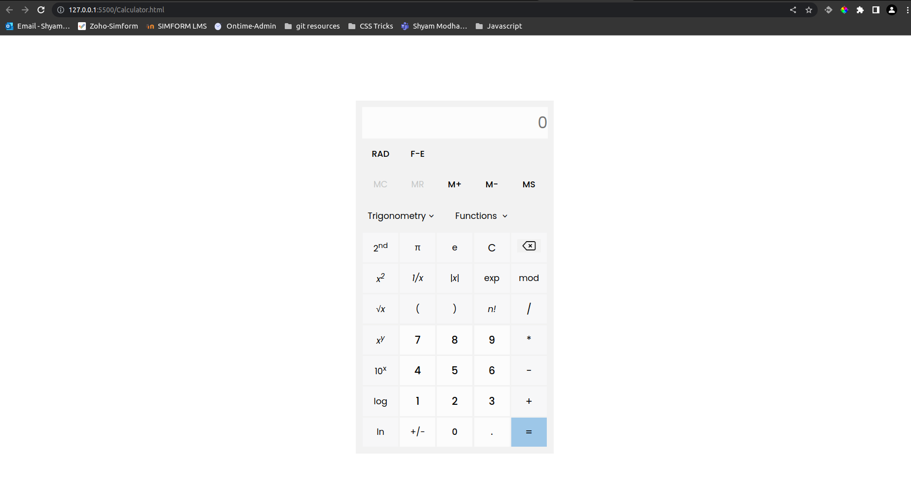

# CRUD Application

    This application should allow user to create new product, update existing product and user should be able to filter product by product id and able to sort it by productId, Product Name and Price. 
    
    Apply proper validation wherever its applicable. Use localStorage for storing product and routing for view/edit product.

## To access it from anywhere

https://cosmic-rabanadas-8a0d06.netlify.app/

## UI Demo of above one:

